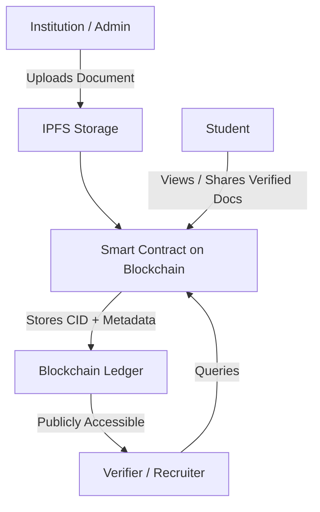

🎓 Authenticity Validator for Academia

A blockchain-based authenticity verification system designed for academic institutions to validate certificates, research papers, and academic records.  
This project leverages smart contracts and decentralized storage (IPFS) to ensure transparency, immutability, and verifiable trust for all academic credential.
🚀 Project Overview

The **Authenticity Validator for Academia** enables universities and institutions to issue, store, and verify documents securely using blockchain technology.  
It eliminates the risk of fake certificates, tampering, and manual verification delays by providing a public, tamper-proof validation system.


🧩 Key Features

- 🧾 **Certificate Issuance** — Institutions can issue certificates stored on IPFS and registered on the blockchain.  
- 🔍 **Verification System** — Anyone can verify authenticity by checking the blockchain record.  
- 🧠 **Creator / Institution Dashboard** — Manage academic documents with a clean UI.  
- 🧑‍🎓 **Student Access** — Students can securely view and share their verified credentials.  
- 🛡️ **Immutability** — Data stored on blockchain ensures long-term trust and transparency.  
- ⚡ **Smart Contracts** — Written in Solidity, powered by Hardhat for deployment and testing.

---

## 📜 Smart Contract Features

The `AcademicValidator` smart contract includes the following enhanced features:

### Core Functionality
- ✅ **Certificate Issuance** — Issue individual certificates with student name, course, IPFS CID, grade, and timestamp
- ✅ **Batch Certificate Issuance** — Issue multiple certificates in a single transaction for efficiency
- ✅ **Certificate Revocation** — Revoke certificates if needed (e.g., academic misconduct)
- ✅ **Certificate Verification** — Verify certificate authenticity and active status by index
- ✅ **Certificate Status Tracking** — Track certificate status (Active/Revoked)

### Advanced Features
- 🔐 **Institution Ownership Transfer** — Transfer contract ownership to a new institution address
- ⏸️ **Emergency Pause/Unpause** — Pause contract operations in case of emergency
- 📊 **Grade Tracking** — Store and retrieve grade/GPA information with each certificate
- 🔍 **Query Functions** — Get certificates by index, count active certificates, view all certificates

### Security Features
- Input validation on all functions
- Access control with `onlyInstitution` modifier
- Emergency pause functionality with `whenNotPaused`/`whenPaused` modifiers
- Comprehensive event emissions for all state changes

### Events
- `CertificateIssued` — Emitted when a certificate is issued
- `CertificateRevoked` — Emitted when a certificate is revoked
- `InstitutionTransferred` — Emitted when ownership is transferred
- `PauseStatusChanged` — Emitted when contract is paused/unpaused

---
🧱 Tech Stack

| Layer | Technology | Description |
|-------|-------------|-------------|
| **Frontend** | React / Next.js | User dashboard for institutions and verifiers |
| **Blockchain** | Solidity + Hardhat | Smart contract logic for document management |
| Storage | IPFS / Pinata | Decentralized storage for academic content (CIDs) |
| Backend (optional) | Node.js / Express | API layer for authentication and metadata |
| Network | Ethereum / Polygon / Local Hardhat | Smart contract deployment environment |

- 🏗️ Project Architecture



---

## 🛠️ Smart Contract Functions

### Write Functions (Institution Only)
1. **`issueCertificate(address, string, string, string, string)`** - Issue a single certificate
2. **`batchIssueCertificates(address[], string[], string[], string[], string[])`** - Issue multiple certificates at once
3. **`revokeCertificate(address, uint256)`** - Revoke a certificate by index
4. **`transferInstitution(address)`** - Transfer ownership to a new institution
5. **`pause()`** - Pause contract operations
6. **`unpause()`** - Unpause contract operations

### Read Functions (Public)
1. **`getCertificates(address)`** - Get all certificates for a student
2. **`getCertificateCount(address)`** - Get total certificate count for a student
3. **`getCertificateByIndex(address, uint256)`** - Get a specific certificate by index
4. **`verifyCertificate(address, uint256)`** - Verify if a certificate is valid and active
5. **`getActiveCertificateCount(address)`** - Get count of active certificates for a student
6. **`institution()`** - Get the current institution address
7. **`paused()`** - Check if contract is paused

---

## 🚀 Getting Started

### Prerequisites
- Node.js (v14+)
- npm or yarn
- Hardhat
- MetaMask or compatible Web3 wallet

### Installation

```bash
# Clone the repository
git clone https://github.com/upendra512/Authenticity-Validator-for-Academia.git
cd Authenticity-Validator-for-Academia

# Install dependencies
npm install

# Compile contracts
npm run compile

# Deploy to Core Testnet
npm run deploy
```

### Testing
```bash
# Run tests
npm test
```

---

## 📄 License
This project is licensed under the MIT License.

---

## 🤝 Contributing
Contributions are welcome! Please feel free to submit a Pull Request.

---

## 📧 Contact
For questions or support, please open an issue in the GitHub repository.
